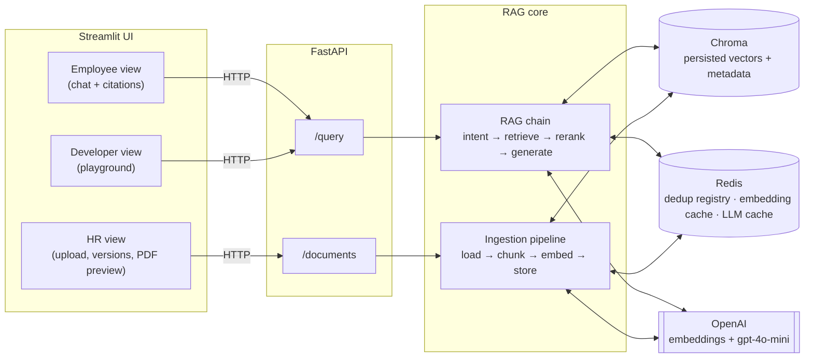
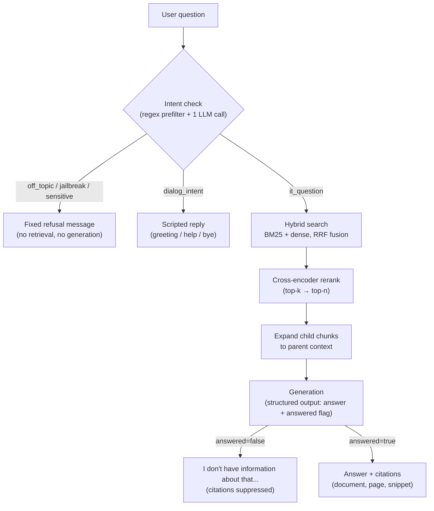
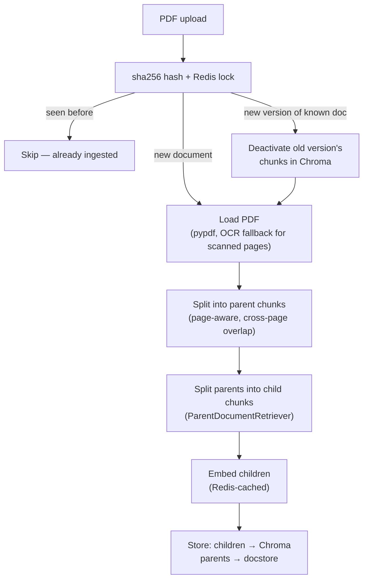

# Port6 — Internal Document RAG Assistant

An AI assistant that answers employee questions about internal HR policies, SOPs, and company documents in plain English — with every answer grounded in and cited to the actual source document and page.

Built as a FastAPI + LangChain backend, a Chroma vector store, and a role-based Streamlit UI (Employee / HR / Developer). The system goes past a naive "embed and retrieve" pipeline — hybrid search, reranking, parent-child chunking, an intent-check guardrail, document versioning, and a Redis caching layer are all real, working parts of the production path, not just described. A Developer Playground lets every one of those choices be measured against the real corpus rather than taken on faith.

## Contents

- [Architecture](#architecture)
- [Query flow](#query-flow)
- [Ingestion flow](#ingestion-flow)
- [Key design decisions](#key-design-decisions)
- [Project structure](#project-structure)
- [Running it locally](#running-it-locally)
- [The Developer Playground](#the-developer-playground)
- [Evaluation results](#evaluation-results)
- [Mission checklist](#mission-checklist)
- [Known limitations / deliberately deferred scope](#known-limitations--deliberately-deferred-scope)

## Architecture

Streamlit never touches the pipeline directly — it's a thin HTTP client to FastAPI, the same way a real production frontend would be.



## Query flow

Every question runs through an intent check before it ever reaches retrieval — most branches never touch the document corpus at all.



## Ingestion flow

Dedup runs before any parsing or embedding happens, so a duplicate upload never costs an OCR pass or an OpenAI call.



## Key design decisions

Every choice below was deliberately evaluated, not defaulted to — most were revised at least once after testing surfaced a real problem.

| Area | Choice | Why |
|---|---|---|
| **Chunking** | Parent-child: parent chunks 1500 chars / 200 overlap, child chunks 400 chars / 60 overlap, via `RecursiveCharacterTextSplitter` | Small child chunks embed precisely for retrieval; the larger parent is what's handed to the LLM, so a match doesn't arrive stripped of surrounding context. Whole-document concatenation with `add_start_index` (not one `Document` per page) so overlap protects a paragraph that spans a page break, instead of resetting at every page boundary — verified: 276/276 chunk boundaries carry real overlap after this fix, vs. 62% before it. |
| **Vector store** | Chroma, persisted to disk (`chroma_db/`) | Metadata (document id, version, active flag, page) lives with the vector in one place — no separate id-mapping file to keep in sync, unlike a bare FAISS index. Verified persistence survives a full process restart with zero re-ingestion. |
| **Retrieval** | Hybrid: BM25 (custom tokenizer that keeps hyphenated codes like `sop-114` intact) + dense search, fused via weighted RRF, then cross-encoder reranked | BM25 catches exact policy-code lookups dense embeddings miss; reranking corrects cases where RRF fusion's blended ranking gets the top result wrong (measured concretely — see [Evaluation results](#evaluation-results)). |
| **Guardrail** | Regex prefilter (catches obvious jailbreak phrasing for free) + one structured-output LLM call classifying into 5 intents (`off_topic` / `jailbreak` / `sensitive` / `dialog_intent` / `it_question`) | Matches the target reference flow exactly, at the cost of one extra LLM call per message. The "sensitive" category is scoped narrowly to *personal disclosure of a real situation* — a general policy question ("what's our harassment reporting process?") is `it_question`, not `sensitive`, after an early version wrongly refused it. |
| **Hallucination defense** | Generation is structured output (`answer`, `answered: bool`) rather than free text | Lets the chain suppress citations when the model itself signals it didn't have enough context, instead of showing a "we don't know" answer next to irrelevant source citations. |
| **Document lifecycle** | Each logical document has a `document_id` + `version` + `active` flag; retrieval defaults to active-only | An updated policy replaces the old one in default retrieval (no answer silently blends old and new numbers) while the old version stays queryable, not deleted, for an explicit comparison. Exact-duplicate re-uploads are a no-op via content hash. |
| **Caching** | Redis: embedding cache (`CacheBackedEmbeddings`), exact-match LLM response cache, and a distributed lock around ingestion dedup | Shared state across process restarts and (if ever scaled) multiple API replicas — an in-process cache wouldn't be. Semantic/near-duplicate caching was deliberately **not** made a production default — a near-match cache hit returning a subtly wrong cached answer is a real risk on a correctness-graded system. |
| **Vector backend & ANN tuning** | Chroma is the only production store; FAISS and HNSW parameter sweeps exist only in the Developer Playground | At this corpus's scale, Chroma and FAISS measure equivalently — a genuine finding, not a reason to run two production stores. HNSW's `M`/`ef_construction`/`ef_search` are real speed-vs-recall knobs, worth showing, not worth exposing to end users. |

## Project structure

```
src/port6/
├── config.py            # Central settings (pydantic-settings) — every tunable value lives here
├── schemas.py            # Shared Pydantic models used end-to-end (DocumentMeta, Chunk, Citation, ...)
├── ingestion/
│   ├── loader.py          # PDF → text, with OCR fallback for scanned pages
│   ├── chunker.py         # Parent-child recursive splitting (+ semantic variant, not yet wired to UI)
│   ├── dedup.py           # Redis-backed hash/version registry, race-safe via a distributed lock
│   └── pipeline.py         # Orchestrates loader → chunker → dedup → vectorstore
├── retrieval/
│   ├── vectorstore.py      # Chroma + parent docstore (ParentDocumentRetriever)
│   ├── hybrid.py            # BM25 + dense fusion (EnsembleRetriever, custom tokenizer)
│   ├── reranker.py          # Cross-encoder reranking
│   ├── faiss_backend.py     # Playground-only: alternate vector backend
│   └── hnsw_backend.py       # Playground-only: HNSW parameter sweep
├── guardrails/
│   └── intent.py            # Regex prefilter + 5-way structured-output intent classifier
├── caching/
│   ├── redis_client.py       # Shared Redis connection
│   ├── embedding_cache.py    # Redis-backed embedding cache
│   └── llm_cache.py          # Redis-backed exact-match LLM response cache
├── rag/
│   ├── prompts.py            # Generation prompt, refusal messages, scripted dialog replies
│   └── chain.py               # The real spine: intent → retrieve → rerank → expand → generate
├── eval/
│   ├── ir_metrics.py          # Deterministic Recall@k / MRR / citation-accuracy
│   ├── ragas_eval.py          # LLM-judged faithfulness / relevancy / precision / recall
│   ├── runner.py              # Runs the golden eval set end-to-end
│   └── strategy_comparison.py # Playground comparisons (retrieval strategy, backend, HNSW)
├── observability/
│   └── tracing.py             # LangSmith wiring (env-var gated, off by default)
├── api/
│   ├── main.py, deps.py
│   └── routers/ingest.py, query.py
└── ui/
    ├── streamlit_app.py       # Entrypoint, role-based navigation
    ├── api_client.py           # Thin requests wrapper — the only thing the UI talks to
    └── views/employee_view.py, hr_view.py, developer_view.py

data/
├── sample_docs/            # 5 realistic MNC-IT-style policy PDFs + their source text + a render script
└── golden_eval_set.json    # 30 hand-verified Q&A pairs used by every eval in this repo
```

## Running it locally

Requires an OpenAI API key and Docker (for Redis).

```bash
# 1. Install dependencies
uv sync

# 2. Configure environment
cp .env.example .env
# edit .env and set OPENAI_API_KEY

# 3. Start Redis
docker compose up -d redis

# 4. Start the API (terminal 1)
uv run uvicorn port6.api.main:app --reload --port 8000

# 5. Start the UI (terminal 2)
uv run streamlit run src/port6/ui/streamlit_app.py
```

Streamlit opens at `localhost:8501`. The `data/sample_docs/` PDFs are the ones already ingested into `data/golden_eval_set.json`'s questions — upload them via the HR view to reproduce the numbers below, or upload any other PDF to test on a genuinely unseen document.

## The Developer Playground

A fourth role in the UI, separate from the graded Employee/HR flow, that exists to answer one question honestly for every advanced technique used here: **does this actually help, at this corpus's scale, or not?** Every number is computed live against the real corpus and `golden_eval_set.json` — nothing is canned.

| Tab | What it measures | What we found |
|---|---|---|
| **Retrieval debug** | Raw retrieved chunks for any typed-in query, from the exact production pipeline | — |
| **Retrieval strategy** | Naive dense-only vs. hybrid vs. hybrid+rerank, on Recall@k / MRR / latency | All three tie on accuracy at this scale; hybrid+rerank is ~150x slower than naive for no retrieval-accuracy gain here — real complexity-vs-payoff evidence, not a hidden cost. |
| **Vector backend** | Chroma vs. FAISS | Equivalent accuracy and latency at this corpus size, as expected — this is *why* Chroma alone is the production store. |
| **HNSW tuning** | M / ef_construction / ef_search sweep, with the actual values and trade-off of each preset shown | At small scale even the "Low" preset holds perfect recall; the accuracy cost of aggressive tuning only shows up as the corpus grows. |
| **Evals** | RAGAS answer-quality metrics (faithfulness, relevancy, context precision/recall), with a one-line explanation of each | Computed-once snapshot, not a live button — a single RAGAS-scored question can take anywhere from ~5s to 300s+ depending on OpenAI API load, making it impractical to run live. See [Evaluation results](#evaluation-results) for the numbers and what they reveal about the metric's own limits. |

## Evaluation results

Full 30-question golden set (27 answerable questions across all 5 documents + 3 refusal-type questions), deterministic metrics:

| Metric | Score |
|---|---|
| Refusal accuracy | 1.00 |
| Recall@k | 1.00 |
| MRR | 1.00 |
| Citation accuracy | 1.00 |

RAGAS (LLM-judged, one representative question per document — see [Known limitations](#known-limitations--deliberately-deferred-scope) for why this is a sample, not the full set):

| Question (document) | Faithfulness | Answer Relevancy | Context Precision | Context Recall |
|---|---|---|---|---|
| Parental leave (leave-policy) | 1.00 | 0.81 | 1.00 | 1.00 |
| Leave payout (leave-policy) | 0.75 | 0.89 | 1.00 | 1.00 |
| SOP-114 expense reimbursement (remote-and-expense-policy) | 0.36 | 0.73 | 1.00 | 0.50 |
| Harassment reporting (conduct-and-safety-policy) | 0.50 | 0.97 | 1.00 | 1.00 |
| Password rotation (it-security-policy) | 1.00 | 0.81 | 1.00 | 0.00 |
| Referral bonus (compensation-and-offboarding-policy) | 1.00 | 0.74 | 1.00 | 1.00 |

Two of these are worth understanding rather than taking at face value:

- **SOP-114's faithfulness (0.36)** — this answer combines two facts (the 30-day deadline *and* the $500 approval threshold) in one response. RAGAS decomposes an answer into individual claims and scores each independently; a longer, compound answer has more claims, so more chances for the judge's paraphrase-matching to flag one as "not literally traceable" even when it's factually correct — a real, verified characteristic of the metric, not a hallucination in the answer itself.
- **Password rotation's context recall (0.00)** — deterministic Recall@k independently confirms retrieval found the correct chunk (which contains "passwords must be changed every 90 days" verbatim) for this exact question. A 0.0 here despite that is the judge failing to match phrasing, not a retrieval failure — the same brittleness as above, in the other direction.

## Mission checklist

| Requirement | Status |
|---|---|
| Parse and chunk 5+ PDFs | 5 documents, 24 parent / 97 child chunks |
| Embeddings in a real, persisted vector DB | Chroma, `chroma_db/`, survives process restart |
| Full RAG pipeline (query → retrieve → answer) | `rag/chain.py` |
| Streamlit UI with citation on every answer | Employee view, expandable Sources panel |
| Chunking strategy is intentional | Parent-child, sizes and overlap fix documented above |
| Retrieval accuracy on prepared questions | Recall@k / MRR / citation accuracy all 1.00 on 27 questions |
| Citation shows exact document + page | `Citation.document_id` / `.page_number` / `.snippet` |
| Handles out-of-scope questions without hallucinating | Intent classifier + structured `answered` flag; verified via 3 refusal-type golden questions |
| Works on a new, unseen document | HR view upload tested repeatedly against documents outside the original 5 |

## Known limitations / deliberately deferred scope

Recorded here rather than silently omitted:

- **Semantic chunking comparison** — `chunker.get_semantic_child_splitter()` exists but isn't wired into a Developer Playground tab yet. Not required by any grading criterion.
- **NeMo Guardrails / Llama Guard** — deliberately not integrated (heavy external setup — Colang config, Ollama — for uncertain payoff versus the lightweight classifier already in place). `nemoguardrails` is declared as an optional dependency group as an extension point, not installed by default.
- **Conversation memory** — the chat UI is stateless per question; a follow-up like "explain them as well" has no reference to resolve. Fixing this properly needs query contextualization (rewriting a follow-up into a standalone question before retrieval) threaded through intent classification *and* retrieval, not just appending chat history to the final generation prompt — that narrower fix wouldn't actually resolve the failure mode. Not required by any grading criterion; deferred rather than half-implemented.
- **Broad "list/summarize everything" questions** — a single retrieval pass structurally can't cover all 5 documents at once; on a broad enumerate-style question the model can fabricate detail for documents it wasn't actually given (verified: asking "list all the SOPs" produced a plausible-looking but partly incorrect list). None of the golden-set questions are this shape; a mentor asking something similarly broad would need this fix to be reliable.
- **RAGAS full-set run** — 27 questions × RAGAS's multi-call metrics is impractical at observed OpenAI API latency (a single question ranged from ~5s to 300s+ across different runs); the Evals tab ships a verified 6-question sample instead of a full run.
